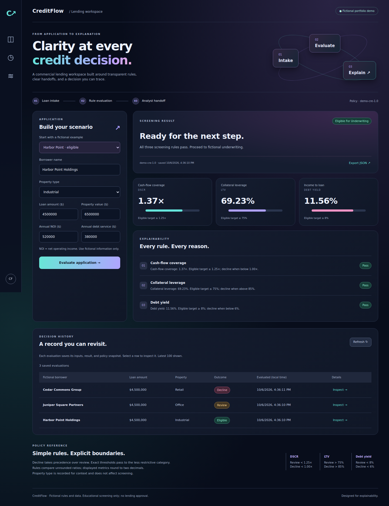

# CreditFlow

**From fictional loan intake to an explainable screening decision.**

CreditFlow is a commercial-lending portfolio project that connects business requirements, deterministic decision rules, an HTTP API, and a working analyst dashboard. Every evaluation retains the submitted inputs, rule explanations, policy version, and policy snapshot.



[**Try the live demo ↗**](https://carla-creditflow.streamlit.app/) · [Business rules](docs/business-rules.md) · [Verification and UAT](docs/verification.md)

## Take a two-minute tour

1. Open the live demo or run the local app and evaluate **Harbor Point**: all three screening rules pass.
2. Choose **Juniper Square**: see why the case needs analyst review.
3. Choose **Cedar Commons**: see decline precedence across triggered rules.
4. Inspect a previous evaluation and export its JSON evidence.
5. Follow a requirement through the [case study](docs/case-study.md), [rule specification](docs/business-rules.md), and [test evidence](docs/verification.md).

## Run locally

Requires Python **3.11 or newer**. No third-party runtime dependencies, credentials, or external services.

```bash
python -m creditflow.server
```

Open **http://127.0.0.1:8000**. On systems using `python3`, substitute it for `python`. Windows users can use `py`.

```bash
python -m unittest discover -s tests -v
```

The app creates `data/creditflow.sqlite3` on first run. Stop it with Ctrl+C. To reset history, stop the app and delete that local database. An alternate database and port can be specified:

```bash
python -m creditflow.server --port 8080 --db data/my-demo.sqlite3
```

## Browser demo / Streamlit hosting

The public-demo adapter in `streamlit_app.py` uses the same decision engine with a dark Streamlit interface. Its history is isolated to each browser session and may clear on reload; export JSON to keep evidence. The original local workspace uses SQLite for persistent history.

```bash
python -m pip install -r requirements.txt
python -m streamlit run streamlit_app.py
```

See the [deployment guide](docs/deployment.md) for Community Cloud settings. The public demo is deployed at [https://carla-creditflow.streamlit.app/](https://carla-creditflow.streamlit.app/).

## What this demonstrates

- **Business analysis:** personas, workflow, user stories, acceptance criteria, and traceability.
- **Credit technology:** DSCR, loan-to-value, and debt-yield calculations with explicit threshold semantics.
- **Product delivery:** responsive dashboard, actionable validation, visible rule explanations, and evidence export.
- **Engineering:** pure Python decision engine, SQLite persistence, a documented API, and automated boundary/integration tests.

| Artifact | Review focus |
| --- | --- |
| [Product case study](docs/case-study.md) | Problem, scope, personas, workflow, and acceptance criteria |
| [Business rules](docs/business-rules.md) | Formulas, threshold boundaries, and outcome precedence |
| [Architecture](docs/architecture.md) | Components, data model, and design choices |
| [OpenAPI contract](docs/openapi.json) | Request/response shapes and error behavior |
| [Verification and UAT](docs/verification.md) | Executed checks, traceability, and remaining validation |

## Scope and limitations

All borrowers, rules, and scenarios are fictional. This is educational screening, **not a validated credit model or lending approval**. It does not use employer data or policy. An eligible result means only that the three demo rules passed.

The original HTTP workspace runs on loopback for local review; the Streamlit demo is publicly hosted with session-only history. It has no authentication, role enforcement, policy administration, manual overrides, or production hosting. Saved records are append-only through the API, but the underlying database is not a tamper-proof audit ledger. No business-impact outcomes are claimed.

Python standard library · SQLite · HTML · CSS · JavaScript
