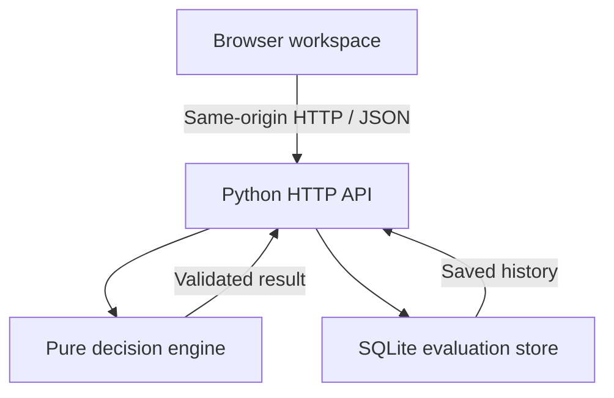

# Architecture and decisions

## Components

- `web/`: responsive HTML/CSS and JavaScript. Borrower content is rendered with `textContent`, not interpreted as HTML. Results remain tied to saved evaluations; editing the form flags pending changes.
- `creditflow/engine.py`: validation, formulas, fixed versioned policy, explanations, precedence. No network or database dependency.
- `creditflow/storage.py`: parameterized SQL inserts/reads; independent connections per operation. Each record contains its full evidence snapshot.
- `creditflow/server.py`: loopback HTTP server, allowlisted static files, bounded request body, cross-origin browser-write rejection, JSON errors, content-security policy.
- `tests/`: standard-library unit and live HTTP integration tests using temporary databases.

Python's standard library keeps the demo portable and avoids dependency setup. This HTTP server is a local demo server, not a production deployment choice. SQLite is sufficient for this single-workspace proof of concept; no migration framework or distributed concurrency guarantee is claimed.

## Data model

| evaluations column | Storage | Purpose |
| --- | --- | --- |
| id | TEXT primary key | UUID for one evaluation |
| created_at | TEXT | ISO 8601 UTC creation timestamp |
| body | TEXT JSON | Inputs, derived ratios, outcome, reasons, policy version and snapshot |

There are no update/delete API routes. Direct database edits remain possible, so this is an application-level history rather than an immutable compliance system. Reads return the latest 100; older records remain addressable by ID. No retention policy is implemented.

## HTTP boundaries

POST validation occurs before insertion. A successful response is sent after SQLite commits. Invalid input is never saved. Double-clicking is disabled in the UI while submission is pending, but API retries create separate records; idempotency is future scope. Cross-origin browser requests are blocked, but this is not authentication. The server binds only to 127.0.0.1.

Future production design would require authenticated access, role enforcement, approved policy lifecycle, database migrations, structured operational errors, rate limits, monitoring, retention, encryption strategy, tamper-evident history, and idempotency. Those are outside this local MVP.

## Hosted demo adapter

`streamlit_app.py` calls the existing pure decision engine directly. It does not expose the local HTTP API or use SQLite. Each browser session has independent, in-memory history capped at 100 records; ending/reloading a session can discard it. JSON download preserves an individual evaluation. No visitor data is intentionally persisted to a shared application database. The demo remains fictional and unauthenticated.

The Streamlit interface uses native controls with the same dark palette; the original custom HTML dashboard remains available through the local server.

## Technical references

- [Python HTTP server documentation](https://docs.python.org/3/library/http.server.html): demo server capabilities and production limitations.
- [GitHub's Python workflow documentation](https://docs.github.com/en/actions/tutorials/build-and-test-code/python): matrix-based automated checks.
