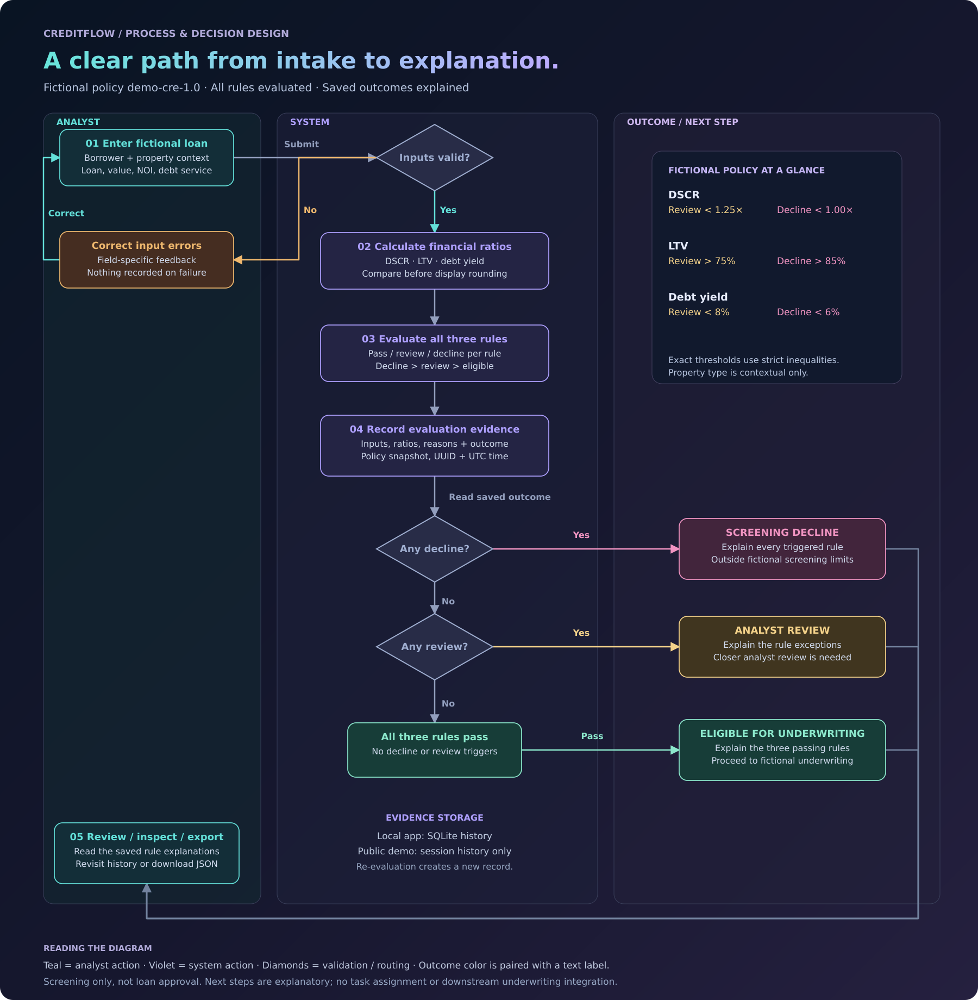

# Product case study

## Problem and intended result

A fictional lending team screens commercial-property loans using three financial ratios. A spreadsheet can calculate the ratios, but the product challenge is making the result understandable and repeatable: which inputs were used, which rules triggered, and what should happen next?

CreditFlow's first release handles one workflow: an analyst enters a fictional scenario, evaluates it, reviews the reasons, and revisits its saved evidence. The proposed benefit is fewer ambiguous handoffs; no operational time savings or credit performance improvements have been measured.

## Personas and scope

| Persona | Need | MVP support |
| --- | --- | --- |
| Intake analyst | Enter complete financial information and correct errors | Validated intake and three sample scenarios |
| Credit analyst | Understand why screening passed or escalated | Ratios, individual rules, outcome precedence |
| Reviewer | Reconstruct the evaluated scenario | Inputs, version, policy snapshot, UTC timestamp, JSON export |

These are research hypotheses for a fictional product, not findings from interviews. Role-specific access is future scope; all local users share one workspace.

Included: four numeric inputs, borrower/property context, deterministic screening, history, evidence export, API contract, and automated checks.

Excluded: real applications, identity verification, credit bureau integrations, document collection, loan pricing, approval authority, authenticated overrides, production authentication, and portfolio analytics. This keeps the first release focused on one complete path.

## Workflow

[Explore the full process flow](process-flow.md) · [Open the editable diagram](diagrams/creditflow-process.drawio)

The diagram separates analyst actions, system checks, and screening outcomes. Colors identify input correction, review, decline, and eligible paths; every status also has a text label. All rules are evaluated before the saved outcome is routed. The local workspace uses SQLite history, while the hosted demo uses per-session history.

If persistence fails, the API does not issue a successful evaluation response. Analyst handoff is communicated as a next step; there is no task assignment or downstream underwriting system in this release.

## Stories and acceptance criteria

| ID | Story | Acceptance criteria |
| --- | --- | --- |
| CF-01 | As an intake analyst, I need valid financial inputs | Missing, invalid, non-finite, negative, excessive-precision, or out-of-range values produce field errors and no saved record. Zero NOI is allowed; divisor amounts must be positive. |
| CF-02 | As a credit analyst, I need repeatable ratios | DSCR = NOI / debt service; LTV = loan / value × 100; debt yield = NOI / loan × 100. Rules compare Decimal ratios before display rounding. |
| CF-03 | As a credit analyst, I need consistent routing | Any decline rule means decline; otherwise any review rule means review; otherwise eligible. Exact thresholds use documented strict inequalities. |
| CF-04 | As a credit analyst, I need reasons for every rule | All three rules show their observed metric, eligible target, decline boundary, and pass/review/decline status. |
| CF-05 | As a reviewer, I need an independent record per evaluation | Successful POST returns a UUID, UTC timestamp, normalized inputs, outcome, rule results, version, and full policy snapshot. Re-evaluation creates a new record. |
| CF-06 | As a reviewer, I need to revisit and export evidence | History shows latest 100 records; Inspect restores that record's inputs/results; export downloads the selected record as JSON. Unsaved form changes are identified. |
| CF-07 | As a user, I need a readable workspace | Inputs have explicit labels, statuses have text as well as color, focus is visible, and the layout adapts to a narrow viewport. |

## Release decisions and future discovery

The MVP uses fixed versioned rules rather than a policy editor. This makes the rule boundaries reviewable and keeps historical evidence self-contained. Property type is contextual only; changing it cannot change a result. Rules do not include a composite risk score, which would require a separate rationale and calibration.

Before a real implementation: confirm user personas through interviews, establish policy ownership and approval authority, define data lineage and retention, design role-specific workflows, validate thresholds with authorized credit experts, and establish production service requirements.

Success measures for a future pilot could include explanation comprehension, time to resolve an exception, and evidence completeness. Baselines and targets would be agreed before collecting results.

## Governance extension
The local workspace now illustrates proposed screening changes and independent reviewer labels, preserving the original evaluation. See [governance](governance.md) for implemented behavior, evidence and identity limitations. The original process diagram describes screening; the review extension is documented separately.
